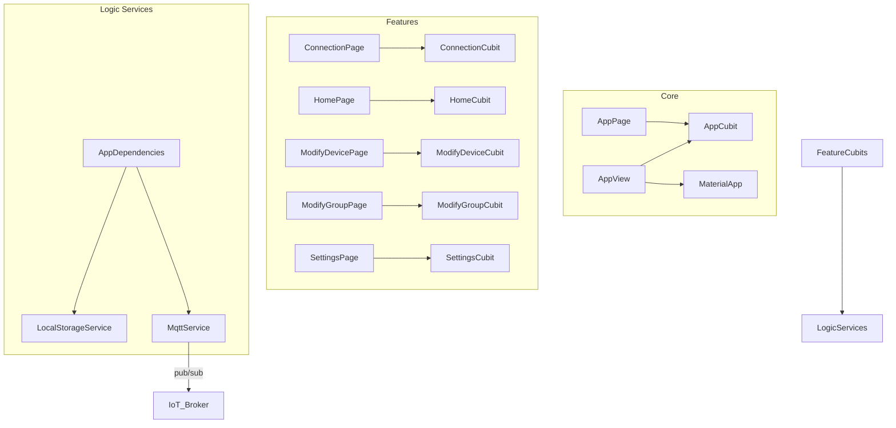

# 📖 Omni Remote

Welcome to the comprehensive documentation for the **Omni Remote** application. This guide covers all key Dart files, organized by functional modules, explains their responsibilities, and illustrates how they interconnect to send and receive data from Arduino and ESP boards using an MQTT broker and custom topics.

---

## 📑 Table of Contents

1. [App Core](#app-core)
   1.1 [State Management (AppCubit)](#state-management-appcubit)
   1.2 [Global Utilities](#global-utilities)
   1.3 [Routing & Themes](#routing--themes)
   1.4 [Services](#services)
   1.5 [UI Layer (View & Widgets)](#ui-layer-view--widgets)
2. [Feature Modules](#feature-modules)
   2.1 [Connection](#connection)
   2.2 [Home](#home)
   2.3 [Modify Device](#modify-device)
   2.4 [Modify Group](#modify-group)
   2.5 [Settings](#settings)
3. [Localization (l10n)](#localization-l10n)
4. [Bootstrap & Entrypoint](#bootstrap--entrypoint)
5. [Packages & Data Models](#packages--data-models)
6. [Configuration (`pubspec.yaml`)](#configuration-pubspecyaml)

---

## App Core

### 1. State Management (AppCubit)

| File                             | Role                                                                                          |
|----------------------------------|-----------------------------------------------------------------------------------------------|
| **lib/app/cubit/app_cubit.dart** | Manages **global app state**: core configurations and fundamental app states during runtime. |
| **lib/app/cubit/app_state.dart** | Immutable state variables serving core elements. Supports `copyWith`.        |

**Core Methods in `AppCubit`:**
- `initialLoad()`  
  - Reads saved configurations and connects core UI constraints.  
  - Emits updated `AppState`.

---

### 2. Global Utilities

| File                             | Role                                                                                          |
|----------------------------------|-----------------------------------------------------------------------------------------------|
| **lib/app/helpers/***            | Collection of UI/data helper functions:    - `ColorHelper`, `IconHelper`, `ThemeHelper`, `EncryptionHelper` for app-wide UI/logic processing. |
| **lib/app/global/app_variables.dart**  | App-wide constants, strings, and configuration variables. |
| **lib/app/global/global.dart**   | Barrel exporting core global functions and variables.                                      |

---

### 3. Routing & Themes

| File                                  | Role                                                                                  |
|---------------------------------------|---------------------------------------------------------------------------------------|
| **lib/app/global/app_router.dart**    | Defines the `GoRouter` navigation graph defining paths to connection, home, settings, and forms. |
| **lib/app/global/app_themes.dart**    | Defines light and dark themes using `ThemeData` to adjust UI accents, card shapes, and typography. |
| **lib/app/global/app_dependencies.dart** | Configuration setup for singletons and dependency injection (using `get_it`). |

---

### 4. Services

| File                                            | Role                                                                                |
|-------------------------------------------------|-------------------------------------------------------------------------------------|
| **lib/app/services/local_storage_service.dart** | Singleton managing local database persistence using `Hive`:    - Initializes and opens `Hive` boxes.   - Registers local models (e.g. `DeviceModelAdapter`). |
| **lib/app/services/mqtt_service.dart**          | Service holding main MQTT logic wrapping `MqttServerClient`:    - Subscribes and publishes to topics from/to Arduino and ESP.   - Manages connection status via `BrokerConnectionStatus` enum. |
| **lib/app/services/services.dart**              | Barrel exporting the main application services.                                                  |

---

### 5. UI Layer (View & Widgets)

#### View

| File                               | Role                                                                                          |
|------------------------------------|-----------------------------------------------------------------------------------------------|
| **lib/app/view/app_page.dart**     | Top-level widget setting up application provider injections linking the bloc logic to the widget tree. |
| **lib/app/view/app_view.dart**     | Consumes `AppCubit`, and configures `MaterialApp` including themes, routing, and l10n. |
| **lib/app/view/view.dart**         | Barrel exporting `app_page.dart` & `app_view.dart`.                                          |

#### Widgets

| File                          | Role                                                                                                             |
|-------------------------------|------------------------------------------------------------------------------------------------------------------|
| **app_icon_selector.dart**    | UI widget providing a symmetric grid structure to pick customizable icons.                                       |
| **app_text_field.dart**       | Custom reusable stylized text field for standardized forms.                                                      |
| **mqtt_topics_info.dart**     | Information display element for viewing current active MQTT topics.                                              |
| **widgets.dart**              | Barrel exporting global shared UI custom components (buttons, dropdowns, inputs).                                |

---

## Feature Modules

Each feature follows a standard Bloc/Cubit architecture pattern structure:
1. **barrel** file (`feature.dart`) exporting `cubit/` and `view/`.
2. **Cubit**: `feature_cubit.dart` + `feature_state.dart`.
3. **Page**: Stateless widget providing the specific cubit.
4. **View**: Stateful or stateless widget using a state builder to display the UI depending on logic emitted by the cubit.

---

### Connection

- **lib/connection/connection.dart**  
- **lib/connection/cubit/connection_cubit.dart**  
- **lib/connection/cubit/connection_state.dart**  
- **lib/connection/view/connection_page.dart**  
- **lib/connection/view/connection_view.dart**  

**Features:**  
Provides the gateway screen for establishing settings required to connect to the external MQTT broker. It bridges the details over to the decoupled `MqttService`.

---

### Home

- **lib/home/home.dart**  
- **lib/home/cubit/home_cubit.dart**  
- **lib/home/cubit/home_state.dart**  
- **lib/home/view/home_page.dart**  
- **lib/home/view/home_view.dart**  

**Highlights:**  
- Acts as the main application dashboard exposing tiles mapped directly to device statuses.
- Utilizes custom specific widgets (e.g., `DeviceBooleanTile`, `DeviceNumberTile`, `GroupCard`) to format data cleanly depending on the expected broker payload types.

---

### Modify Device

- **lib/modify_device/modify_device.dart**  
- **lib/modify_device/cubit/modify_device_cubit.dart**  
- **lib/modify_device/cubit/modify_device_state.dart**  
- **lib/modify_device/view/modify_device_page.dart**  
- **lib/modify_device/view/modify_device_view.dart**  

**Capabilities:**  
- Data entry form dedicated to generating or updating `DeviceModel` parameters (names, specific topic strings, visual colors/icons) stored inside the active `Hive` persistence box.

---

### Modify Group

- **lib/modify_group/modify_group.dart**  
- **lib/modify_group/cubit/modify_group_cubit.dart**  
- **lib/modify_group/cubit/modify_group_state.dart**  
- **lib/modify_group/view/modify_group_page.dart**  
- **lib/modify_group/view/modify_group_view.dart**  

**Features:**  
- Analogous structured form matching the device equivalent context, solely handling the creation/modification parameters for `GroupModel` components interacting simultaneously with multiple devices.

---

### Settings

- **lib/settings/settings.dart**  
- **lib/settings/cubit/settings_cubit.dart**  
- **lib/settings/cubit/settings_state.dart**  
- **lib/settings/view/settings_page.dart**  
- **lib/settings/view/settings_view.dart**  

**Controls:**  
- Unified hub altering universal parameters (theme configurations, localization language). Passes preferences backward to be maintained securely inside `LocalStorageService`.

---

## Localization (l10n)

| File                               | Role                                                  |
|------------------------------------|-------------------------------------------------------|
| **lib/l10n/app_en.arb**            | English string dictionary values.                     |
| **lib/l10n/app_es.arb**            | Spanish translation map values.                       |
| **lib/l10n/app_it.arb**            | Italian translation map values.                       |
| **lib/l10n/gen/***                 | Folder containing dynamically generated delegates.    |

**Mechanism:** Utilizing Flutter standard `l10n` capabilities based on `.arb` file configurations generating standard translation accessors.

---

## Bootstrap & Entrypoint

| File                          | Role                                                                                   |
|-------------------------------|----------------------------------------------------------------------------------------|
| **lib/bootstrap.dart**        | Intercepts application initialization, configuring error logging and calling `runApp()`. |
| **lib/main.dart**             |    1. Triggers initial execution context.   2. Sets up `AppDependencies` initializing singletons (`LocalStorageService`, `MqttService`).   3. Dispatches execution flow over to `bootstrap`. |

---

## Packages & Data Models

Unlike complex distributed projects, Omni Remote centralizes its specific entity interactions locally through internal declarative records. 

### Data Models

- **lib/app/models/device_model.dart**  
Contains the physical parameters of an individual device mapped cleanly via Hive annotations (`HiveType`) saving references directly without remote synchronization mechanisms.

- **lib/app/models/group_model.dart**  
Similar Hive annotated model used purely to combine properties of independent devices establishing hierarchical commands across different grouped endpoints.

These classes interact seamlessly as the main underlying format populating the `home` application views.

---

## Configuration (`pubspec.yaml`)

- Core dependencies defining internal toolings: `flutter_bloc` & `equatable` (handling deterministic state propagation), `hive` & `hive_flutter` (speed-focused cache store), `go_router` (URI routing maps) and `mqtt_client` (TCP socket broker streaming).
- Defines environment constraints formatting image assets matching platform icon specs (`assets/images`).
- Includes code quality lint rules extending `very_good_analysis`.

---

# 🎬 Summary of Relationships

- **Logic Services**: Main gateway connecting asynchronous system memory with external remote device nodes.  
- **UI Architecture**: Standardized presentation layer decoupled from persistent structures directly listening to BLoC streams emitting from `Connection` and `Home` activities.

---

> **Enjoy building and extending the Omni Remote app!**
