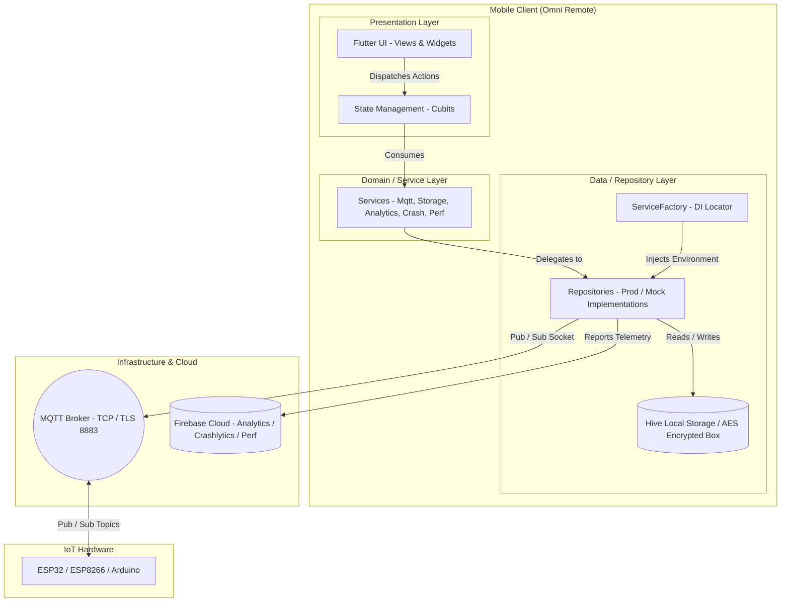

# 📖 Omni Remote

[](https://github.com/Piero16301/Omni_Remote/actions/workflows/beta.yaml?query=branch%3Adev)
[](https://codecov.io/gh/Piero16301/Omni_Remote/branch/dev)
[](https://github.com/Piero16301/Omni_Remote)
[](https://opensource.org/licenses/MIT)
[](https://buymeacoffee.com/sanjuanpamk)

Welcome to the comprehensive documentation for the **Omni Remote** application. Omni Remote is a cross-platform Flutter application designed to monitor and remotely control IoT hardware devices (ESP32, ESP8266, Arduino) in real-time through an MQTT broker with custom Pub/Sub topic hierarchies.

---

## 📑 Table of Contents

1. [Project Status & Quality](#-project-status--quality)
2. [System Architecture](#-system-architecture)
   - [Architectural Overview](#architectural-overview)
   - [Layered Clean Architecture](#layered-clean-architecture)
3. [MQTT Communication Protocol](#-mqtt-communication-protocol)
   - [Topic Structure & Normalization](#topic-structure--normalization)
   - [Payload Formats & Last Will](#payload-formats--last-will)
4. [Project Structure](#-project-structure)
5. [Core App Layer (`lib/app`)](#-core-app-layer-libapp)
   - [State Management (`AppCubit`)](#state-management-appcubit)
   - [Dependency Injection & Environments (`app_dependencies.dart`)](#dependency-injection--environments)
   - [Repositories (`lib/app/repositories`)](#repositories-libapprepositories)
   - [Services (`lib/app/services`)](#services-libappservices)
   - [Routing & Navigation (`app_router.dart`)](#routing--navigation)
   - [Theming & Fonts (`app_themes.dart`)](#theming--fonts)
   - [Data Models & Hive Adapters (`lib/app/models`)](#data-models--hive-adapters)
   - [Global Widgets & Helpers](#global-widgets--helpers)
6. [Feature Modules](#-feature-modules)
   - [Connection](#1-connection)
   - [Home](#2-home)
   - [Modify Device](#3-modify-device)
   - [Modify Group](#4-modify-group)
   - [Settings](#5-settings)
7. [Internationalization & Localization (`l10n`)](#-internationalization--localization-l10n)
8. [Bootstrap & Entrypoint](#-bootstrap--entrypoint)
9. [Testing & Quality Assurance](#-testing--quality-assurance)
10. [Development & Build Commands](#-development--build-commands)

---

## 📊 Project Status & Quality

- **Flutter SDK:** `>=3.47.0` (Dart SDK `>=3.12.0 <4.0.0`)
- **Linting & Code Style:** Adheres to strict [`very_good_analysis`](https://pub.dev/packages/very_good_analysis) rules with zero analysis issues (`fvm flutter analyze` passing).
- **Code Coverage:** **92.4% line coverage** across 61 source files (unit, bloc, widget, and repository tests).
- **Formatting:** 100% formatted according to `dart format`.
- **Telemetry & Monitoring:** Integrated with Firebase Core, Analytics, Crashlytics, and Performance Monitoring.
- **Security:** Encrypted Hive box for sensitive MQTT broker credentials via `EncryptionHelper`.

---

## 🏗️ System Architecture

### Architectural Overview


```mermaid
flowchart TD
  subgraph "Mobile Client (Omni Remote)"
    subgraph "Presentation Layer"
      UI[Flutter UI - Views & Widgets]
      Bloc[State Management - Cubits]
    end

    subgraph "Domain / Service Layer"
      Services[Services - Mqtt, Storage, Analytics, Crash, Perf]
    end

    subgraph "Data / Repository Layer"
      ServiceFactory[ServiceFactory - DI Locator]
      Repos[Repositories - Prod / Mock Implementations]
      LocalDB[(Hive Local Storage / AES Encrypted Box)]
    end
  end

  subgraph "Infrastructure & Cloud"
    Broker((MQTT Broker - TCP / TLS 8883))
    Firebase[(Firebase Cloud - Analytics / Crashlytics / Perf)]
  end

  subgraph "IoT Hardware"
    ESP[ESP32 / ESP8266 / Arduino]
  end

  UI -->|Dispatches Actions| Bloc
  Bloc -->|Consumes| Services
  Services -->|Delegates to| Repos
  ServiceFactory -->|Injects Environment| Repos
  Repos -->|Reads / Writes| LocalDB
  Repos -->|Pub / Sub Socket| Broker
  Repos -->|Reports Telemetry| Firebase
  Broker <-->|Pub / Sub Topics| ESP
```

### Layered Clean Architecture

The application is structured into decoupled layers following Clean Architecture principles:

1. **Presentation Layer (`lib/<feature>/view`, `lib/<feature>/widgets`):**
   - Pure UI widgets driven by `flutter_bloc` state observers (`BlocBuilder`, `BlocConsumer`, `BlocListener`).
   - Uses `material_ui` design components with dynamic theme brightness and custom primary color seeds.
2. **State Layer (`lib/<feature>/cubit`):**
   - Business logic isolated in `Cubit` classes with immutable state models supporting `copyWith`.
3. **Service Layer (`lib/app/services`):**
   - Application services that coordinate repositories and provide high-level operations (`MqttService`, `LocalStorageService`, `AnalyticsService`, `CrashService`, `PerformanceService`).
4. **Repository Layer (`lib/app/repositories`):**
   - Abstract repository contracts with dual implementations:
     - **Production (`*Repository`):** Communicates with real external systems (Hive, `MqttServerClient`, Firebase SDKs).
     - **Mock (`Mock*Repository`):** In-memory deterministic implementations enabling offline unit and widget testing without external hardware or cloud dependencies.
5. **Service Locator & Factory (`lib/app/global/app_dependencies.dart`):**
   - Uses `GetIt` with a `ServiceFactory` configuring the application based on `Environment.prod` or `Environment.mock`.

---

## 📡 MQTT Communication Protocol

Omni Remote communicates bidirectionally with hardware microcontrollers using MQTT topics.

### Topic Structure & Normalization

All group and device names are automatically normalized (converted to lowercase, accents replaced, whitespace converted to hyphens):

| Level | Topic Format | Example | Description |
| :--- | :--- | :--- | :--- |
| **Group Command** | `{group}/command` | `living-room/command` | Publishes actions targeting all devices in a group |
| **Group Status** | `{group}/status` | `living-room/status` | Subscribes to telemetry of group status |
| **Group Online** | `{group}/online` | `living-room/online` | Online/offline availability status of the group |
| **Device Command** | `{group}/{device}/command` | `living-room/ceiling-light/command` | Publishes actuation commands for a specific device |
| **Device Status** | `{group}/{device}/status` | `living-room/ceiling-light/status` | Subscribes to real-time status updates of a specific device |
| **Device Online** | `{group}/{device}/online` | `living-room/ceiling-light/online` | Microcontroller heartbeat / availability status |

### Payload Formats & Last Will

- **Boolean Device:** Receives and transmits string payloads `'true'` or `'false'`.
- **Number / Range Device:** Transmits formatted numeric values within configured `rangeMin` and `rangeMax` bounds, supporting stepped `divisions` and custom `interval` steps.
- **Last Will and Testament (LWT):**
  - Topic: `application/lastwill`
  - Message: `Client disconnected unexpectedly`
  - QoS: `MqttQos.atLeastOnce`
- **Security:** Supports TLS/SSL certificate negotiation on secure ports (e.g., `8883`) with auto-reconnect and 60-second keep-alive intervals.

---

## 📂 Project Structure

```
Omni_Remote/
├── assets/
│   ├── fonts/               # 9 bundled variable typography font families
│   └── images/              # Application icon, branding, and platform logos
├── lib/
│   ├── app/
│   │   ├── cubit/           # Global app state (theme, language, font, MQTT status)
│   │   ├── global/          # Router, dependencies, themes, constants, snackbars
│   │   ├── helpers/         # Color, encryption, icon, and theme helper utilities
│   │   ├── models/          # DeviceModel, GroupModel, AppRouteObserver
│   │   ├── repositories/    # Abstract & concrete repositories (Prod & Mock)
│   │   ├── services/        # Service facades wrapping repositories
│   │   ├── view/            # Top-level AppPage & AppView configurations
│   │   └── widgets/         # App-wide reusable UI components
│   ├── connection/          # Broker connection configuration feature
│   ├── home/                # Main dashboard with real-time device & group tiles
│   ├── modify_device/       # Device creation & modification form
│   ├── modify_group/        # Group creation & modification form
│   ├── settings/            # Application settings (theme, font, locale, telemetry)
│   ├── l10n/                # Localization ARB files and generated delegates
│   ├── bootstrap.dart       # Error interceptors, Crashlytics, and BlocObserver
│   ├── firebase_options.dart# Firebase multi-platform configuration
│   └── main.dart            # Execution entrypoint & dependency initialization
└── test/                    # Comprehensive unit, widget, and bloc test suites (92%+ coverage)
```

---

## ⚙️ Core App Layer (`lib/app`)

### State Management (`AppCubit`)

`AppCubit` (`lib/app/cubit/app_cubit.dart`) manages global runtime preferences and connectivity status:

- `initialize()`: Reads persisted settings for locale, theme mode, base color, and font family; emits initial `AppState` and assigns Crashlytics diagnostic keys.
- `initializeMqttClient()`: Listens to the `MqttService.connectionStatusStream` and initializes broker connectivity asynchronously.
- `changeLanguage(Locale)`: Updates application language and logs analytics event.
- `changeTheme(ThemeMode)`: Switches between Light, Dark, and System theme modes.
- `changeBaseColor(Color)`: Dynamically re-seeds Material 3 color palettes across the entire app.
- `changeFontFamily(String)`: Switches between 9 available bundled font families in real-time.
- `connectMqtt()`, `disconnectMqtt()`, `reconnectWithNewSettings()`: Controls active broker connections.

### Dependency Injection & Environments

Configured in `lib/app/global/app_dependencies.dart` via `GetIt`:

```dart
void setupServiceLocator(Environment env);
```

- Supported environments: `Environment.prod` and `Environment.mock`.
- `ServiceFactory` creates the appropriate repository instances:
  - `CrashRepository` (`CrashlyticsCrashRepository` vs `MockCrashRepository`)
  - `PerformanceRepository` (`FirebasePerformanceRepository` vs `MockPerformanceRepository`)
  - `AnalyticsRepository` (`FirebaseAnalyticsRepository` vs `MockAnalyticsRepository`)
  - `LocalStorageRepository` (`HiveLocalStorageRepository` vs `MockLocalStorageRepository`)
  - `MqttRepository` (`ServerMqttRepository` vs `MockMqttRepository`)

### Repositories (`lib/app/repositories`)

| Repository | Production Class | Mock Class | Responsibilities |
| :--- | :--- | :--- | :--- |
| **`MqttRepository`** | `ServerMqttRepository` | `MockMqttRepository` | MQTT client lifecycle, TLS config, auto-reconnect, message streams, LWT. |
| **`LocalStorageRepository`** | `HiveLocalStorageRepository` | `MockLocalStorageRepository` | Hive box persistence, encrypted credential storage, reactive list observers. |
| **`AnalyticsRepository`** | `FirebaseAnalyticsRepository` | `MockAnalyticsRepository` | Event tracking, screen navigation logging. |
| **`CrashRepository`** | `CrashlyticsCrashRepository` | `MockCrashRepository` | Fatal and non-fatal error reporting, diagnostic keys, log breadcrumbs. |
| **`PerformanceRepository`** | `FirebasePerformanceRepository` | `MockPerformanceRepository` | Custom execution traces (initialization, MQTT connection, Hive operations). |

### Services (`lib/app/services`)

Thin coordination facades injected as lazy singletons:
- `MqttService`: Exposes connection status stream and message stream.
- `LocalStorageService`: Manages device CRUD, group CRUD, and user preferences.
- `AnalyticsService`: User interactions and screen view telemetry.
- `CrashService`: Application error recording.
- `PerformanceService`: Startup and runtime trace monitoring.

### Routing & Navigation

Defined in `lib/app/global/app_router.dart` using `GoRouter`:

- `/`: `HomePage` — Main dashboard.
- `/connection`: `ConnectionPage` — MQTT broker settings.
- `/settings`: `SettingsPage` — Personalization, language, and theme.
- `/modify-group`: `ModifyGroupPage` — Create or edit device groups.
- `/modify-device`: `ModifyDevicePage` — Create or edit individual devices.
- Includes `AppRouteObserver` linked to `AnalyticsService` for automatic screen tracking on every route push, pop, and replace.

### Theming & Fonts

- **Material UI / Material 3:** Supports full dynamic seeding based on `AppState.baseColor`.
- **Bundled Fonts:** 9 variable typography families available without network calls:
  - *Google Sans Flex* (Default), *Merriweather*, *Montserrat*, *Nunito*, *Open Sans*, *Orbitron*, *Playfair Display*, *Roboto*, *Source Code Pro*.

### Data Models & Hive Adapters

Persisted locally using Hive binary storage:

1. **`DeviceModel` (Type ID: 1):**
   - Fields: `id`, `title`, `subtitle`, `icon`, `tileType`, `groupId`, `rangeMin`, `rangeMax`, `divisions`, `interval`.
   - `DeviceTileType` enum (Type ID: 0): `boolean` or `number`.
2. **`GroupModel` (Type ID: 2):**
   - Fields: `id`, `title`, `subtitle`, `icon`.

### Global Widgets & Helpers

- **Widgets (`lib/app/widgets`):** `AppDropdownField`, `AppFilledButton`, `AppOutlinedButton`, `AppIconSelector`, `AppTextField`, `MqttTopicsInfo`.
- **Helpers (`lib/app/helpers`):**
  - `ColorHelper`: Color mapping and hexadecimal translation.
  - `EncryptionHelper`: Secure 256-bit AES encryption cipher management for Hive boxes.
  - `IconHelper`: Icon parsing and rendering.
  - `ThemeHelper`: Theme mode conversion.
  - `AppFunctions`: Floating custom SnackBar notifications (`success`, `error`, `warning`, `info`).

---

## 📱 Feature Modules

### 1. Connection
- **Path:** `lib/connection/`
- **Cubit:** `ConnectionCubit` / `ConnectionState`
- **View:** `ConnectionPage` / `ConnectionView`
- **Capabilities:** Configure broker URL, port (supporting TLS on 8883), username, and password. Stores credentials in an encrypted Hive box and triggers client reconnection.

### 2. Home
- **Path:** `lib/home/`
- **Cubit:** `HomeCubit` / `HomeState`
- **View:** `HomePage` / `HomeView`
- **Widgets:**
  - `GroupCard`: Displays group identity, contains device tiles, and publishes group-wide commands.
  - `DeviceBooleanTile`: Toggle switch tile publishing boolean MQTT payloads and listening to status topics.
  - `DeviceNumberTile`: Slider and stepper tile for numeric control with configured intervals.

### 3. Modify Device
- **Path:** `lib/modify_device/`
- **Cubit:** `ModifyDeviceCubit` / `ModifyDeviceState`
- **View:** `ModifyDevicePage` / `ModifyDeviceView`
- **Widgets:** `DevicePreview`, `TileTypeSelector`
- **Capabilities:** Form validation, duplicate title prevention per group, icon picker, group assignment, and tile type configuration.

### 4. Modify Group
- **Path:** `lib/modify_group/`
- **Cubit:** `ModifyGroupCubit` / `ModifyGroupState`
- **View:** `ModifyGroupPage` / `ModifyGroupView`
- **Widgets:** `GroupPreview`
- **Capabilities:** Create and edit device groups, validate unique group titles, select representative icons, and preview group cards in real-time.

### 5. Settings
- **Path:** `lib/settings/`
- **Cubit:** `SettingsCubit` / `SettingsState`
- **View:** `SettingsPage` / `SettingsView`
- **Widgets:** `SettingsAppSpecs`, `SettingsCardBlock`
- **Capabilities:** Dynamic language switcher, theme mode selection (System/Light/Dark), dynamic accent color palette selector, font family selector, and application specifications display (version, build, packages).

---

## 🌐 Internationalization & Localization (`l10n`)

Omni Remote supports **6 languages** out of the box using Flutter's native ARB localization workflow:

| Language | Locale Code | ARB File |
| :--- | :--- | :--- |
| **English** | `en_US` | `lib/l10n/arb/app_en.arb` |
| **Spanish** | `es_ES` | `lib/l10n/arb/app_es.arb` |
| **Italian** | `it_IT` | `lib/l10n/arb/app_it.arb` |
| **French** | `fr_FR` | `lib/l10n/arb/app_fr.arb` |
| **German** | `de_DE` | `lib/l10n/arb/app_de.arb` |
| **Portuguese** | `pt_PT` | `lib/l10n/arb/app_pt.arb` |

Access translation strings via the context extension:
```dart
context.l10n.someStringKey
```

---

## 🚀 Bootstrap & Entrypoint

### `lib/main.dart`
1. Ensures Flutter widget bindings are initialized.
2. Initializes Firebase with `DefaultFirebaseOptions.currentPlatform`.
3. Calls `setupServiceLocator(Environment.prod)`.
4. Starts performance traces for startup profiling.
5. Initializes `LocalStorageService` (Hive boxes & adapters).
6. Dispatches to `bootstrap(() => const AppPage())`.

### `lib/bootstrap.dart`
- Captures uncaught Flutter framework errors via `FlutterError.onError` and logs them to `CrashService`.
- Captures asynchronous platform errors via `PlatformDispatcher.instance.onError`.
- Sets `Bloc.observer = const AppBlocObserver()` to log and trace all Cubit transitions and errors.

---

## 🧪 Testing & Quality Assurance

The test suite mirrors the structure of `lib/` and achieves **92.4% test coverage**:

```
test/
├── app/
│   ├── cubit/              # AppCubit tests
│   ├── global/             # Functions, themes, router, dependencies tests
│   ├── helpers/            # Color, encryption, icon, theme helper tests
│   ├── models/             # DeviceModel and GroupModel serialization tests
│   ├── repositories/       # Production and mock repository tests
│   ├── services/           # Service unit tests
│   ├── view/               # AppPage and AppView widget tests
│   └── widgets/            # Shared widget tests
├── connection/             # Connection Cubit and View tests
├── helpers/                # pump_app test helper with l10n, routing, and bloc providers
├── home/                   # Home Cubit, View, and Tile widget tests
├── l10n/                   # Translation key completeness tests
├── modify_device/          # Device creation Cubit, View, and widget tests
├── modify_group/           # Group creation Cubit, View, and widget tests
└── settings/               # Settings Cubit, View, and widget tests
```

---

## 🛠️ Development & Build Commands

All Flutter commands can be run using [FVM](https://fvm.app/) or standard Flutter CLI:

```bash
# Analyze code for errors and lint warnings
fvm flutter analyze

# Format all Dart files
fvm dart format --set-exit-if-changed lib test

# Run all tests with coverage
fvm flutter test --coverage

# Generate HTML coverage report (macOS/Linux)
genhtml coverage/lcov.info -o coverage/html && open coverage/html/index.html

# Regenerate code generation files (Hive adapters, l10n)
fvm dart run build_runner build --delete-conflicting-outputs
fvm flutter gen-l10n

# Update launcher icons
fvm dart run flutter_launcher_icons
```

---

> **Omni Remote** — Engineered with clean architecture, robust testing, and real-time MQTT telemetry.
